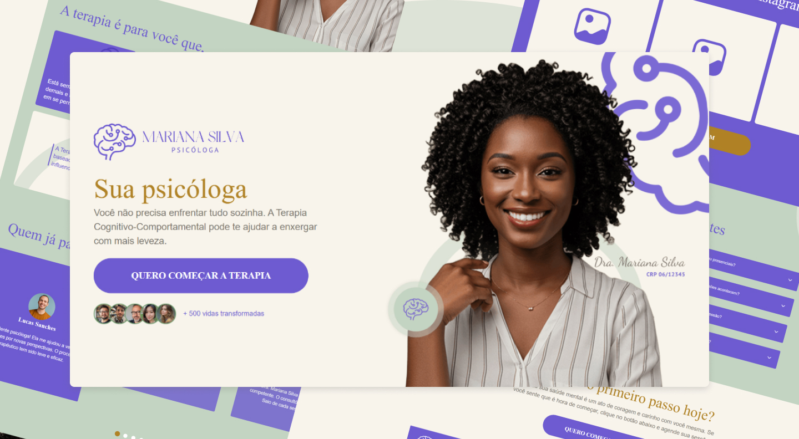

# Landing Page - Mariana Silva Psicológa

Esta Landing Page foi cuidadosamente projetada para ser mais do que uma vitrine: é o primeiro passo na jornada de acolhimento e transformação do paciente. O objetivo principal é estabelecer uma conexão imediata, convertendo visitantes que buscam alívio emocional em pacientes ativos da Dra. Mariana Silva.

Com essa presença online, Mariana vai terá:
- Vitrine do seu trabalho exposto na internet;
- Mais visibilidade, maior autoridade profissional;
- Comunicação clara sobre seus serviços;
- Aumento no número de agendamentos;
- Melhor posicionamento no Google;
- Facilidade para o paciente encontrar informações essenciais;
- Transmitir mais confiança e profissionalismo já no primeiro contato.


**[Clique aqui para visualizar o projeto no ar](https://juliamariaa.github.io/mariana-silva-psicologa-lp/)**



### 🎨 Arquitetura de Design (UX/UI)

O design foi criado para refletir a **leveza e o acolhimento** da psicologia, estabelecendo confiança e seriedade profissional.

**[Clique aqui para visualizar o design completo](https://www.behance.net/gallery/240203007/Landing-Page-Mariana-Silva-Psicologa)**

#### Paleta de Cores
O **Roxo**, cor principal da profissional, foi mantido como destaque. Para equilibrar sua intensidade, foram escolhidos o **Verde Claro** e o **Bronze** como tons complementares. Esta combinação injeta delicadeza e serenidade, essenciais para o tema terapêutico.

#### Elementos Visuais
A fotografia da Mariana, com **blusa clara e sorriso acolhedor**, foi escolhida para reforçar a leveza visual e criar uma conexão imediata, encorajando o usuário a dar o primeiro passo na terapia.

#### Tipografia: Sofisticação e Legibilidade
* **PT Serif (Títulos):** Fonte com serifa que confere elegância e profissionalismo, alinhada à credibilidade da psicóloga.
* **PT Sans (Corpo do Texto):** Fonte sem serifa, limpa e de alta legibilidade, otimizada para textos longos. A combinação equilibra sofisticação com fluidez na leitura.

### 📁 Tecnologias Utilizadas & Arquitetura do Projeto

#### Tecnologias Utilizadas
- React.js - Biblioteca principal para construir a interface
- Tailwind CSS - Estilização utilitária e responsiva
- Vite - Bundler e ambiente de desenvolvimento rápido
- Git & GitHub – Controle de versão e hospedagem do repositório
- Figma - Design e prototipação da interface

#### Arquitetura do Projeto

```
MARIANA-SILVA-PSICOLOGA-LP/
├── node_modules/           
├── public/                 
├── src/                    
│   ├── assets/             
│   ├── components/         
│   ├── data/               
│   ├── layouts/            
│   ├── pages/              
│   ├── sections/           
│   ├── App.jsx             
│   ├── index.css           
│   └── main.jsx            
├── .gitignore              
├── index.html              
├── package-lock.json       
├── package.json            
├── README.md               
└── vite.config.js                  
```
#### Detalhamento da Pasta src/

| Diretório/Arquivo  | Descrição |
| ------------- |:-------------:|
| assets/      | Armazena todos as imagens e ícones importados pelo React.    |
| components/      | Contém a menor granularidade de componentes, focados em reusabilidade e modularidade.      |
| data/      | Ponto centralizado para dados estáticos que são consumidos pelas seções, como depoimentos de pacientes e dados do FAQ. Facilita a edição de conteúdo sem alterar a lógica dos componentes.    |
| layouts/      | Componentes de alto nível que definem o esqueleto da página e a estrutura repetitiva, como o Header e o Footer.    |
| pages/      | Define a estrutura de visualização de página completa.   |
| sections/     | Contém os grandes blocos de conteúdo que compõem a Landing Page   |
| App.jsx     | O componente raiz do React, responsável por orquestrar a aplicação   |
| index.css    | Estilos globais da aplicação e também onde ficam minhas configurações personalizadas de estilos do Tailwind CSS  |
| main.jsx     | O ponto de inicialização do aplicativo, onde o React é injetado no index.html    |

### 📥 Como baixar o projeto na sua máquina

Siga o passo a passo abaixo para clonar e rodar o projeto localmente:

1. **Clone este repositório**
   ```
   git clone https://github.com/juliamariaa/mariana-silva-psicologa-lp
   ```

2. **Acesse a pasta do projeto**
    ```
    cd mariana-silva-psicologa-lp
    ```
    
3. **Instale as dependências**
    ```
    npm install 
    ```
    ou
    ``` 
    yarn install
    ```

4. **Execute o projeto em ambiente de desenvolvimento**
    ``` 
    npm run dev 
    ```
    ou
    ``` 
    yarn dev
    ```

5. **Abra no navegador**
    ```
    http://localhost:5173
    ```
    
A porta pode variar dependendo da ferramenta usada.

Pronto! O projeto estará rodando na sua máquina. 🚀


### 👩‍💻​ Desenvolvedora & Contato

Este projeto foi desenhado e desenvolvido por:

**Júlia Maria** | *Front-end Developer & UI Designer*

Agradeço por conferir meu trabalho! Se você gostou da arquitetura do código, do design ou quer trocar uma ideia, adoraria conversar.

#### Conecte-se comigo

- 💌  **E-mail:** Quer falar comigo? É só enviar para ➡️ juliamariadev@gmail.com
- 🔗 **LinkedIn:** Vamos nos conectar? ➡️ [Clique aqui para acessar meu perfil](https://www.linkedin.com/in/j%C3%BAlia-maria/)
- 📸 **Instagram:** Acompanhe bastidores, dicas de desenvolvimento e design em @juliamaria.dev ➡️ [Clique aqui para me acompanhar](https://www.instagram.com/juliamaria.dev/)


### 📄 Licença do Projeto

Esse projeto foi desenvolvido para fins educacionais.  
Todo o código e design presente na Landing Page é de minha autoria e **não pode ser replicado sem os devidos créditos**.
